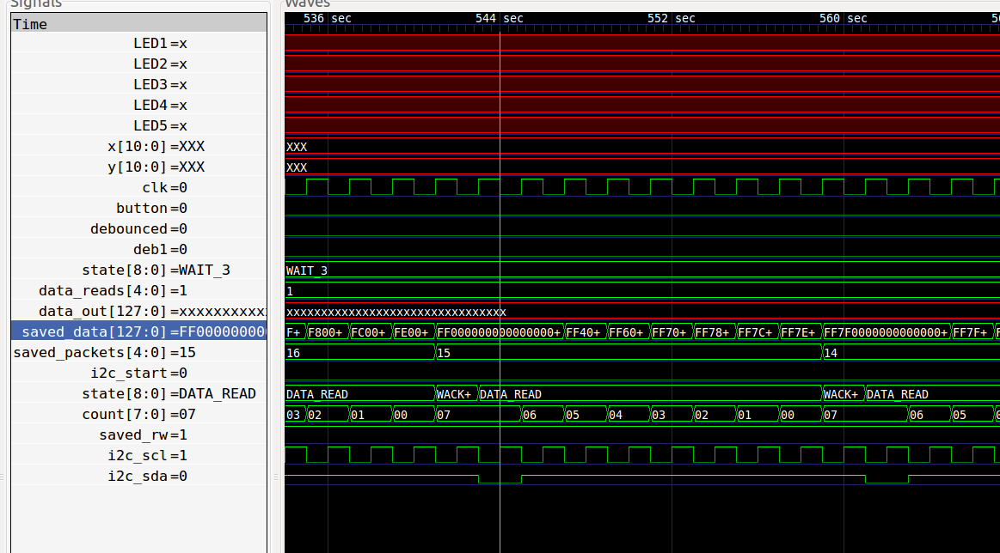

# fpga virtual graffiti

IR led >> wiimote infrared camera (i2c) >> fpga >> projector (dvi)

my first 'proper' fpga project.

with the icestick usb board, and icestorm free fpga tools.
with gtkwave for debugging.

# i2c reader / writer

based on useful youtube series:https://www.youtube.com/watch?v=rWzB5hZlqBA
by Tom Briggs.

currently having problems with reading i2c data:
Can read setup and requets i2c data, but testbench shows data will be corrupt.

currently having problems with reading i2c data:

image made with gtkwave: 

    make debug-i2c 

Picture shows 1st byte reads FF, but second 7F because first bit is read as 0.

I think because I'm sampling sda in the time when i2c data is allowed to change. 

This is because sck is assigned to !clk, but the state machine is clocked on positive edge of clk.
