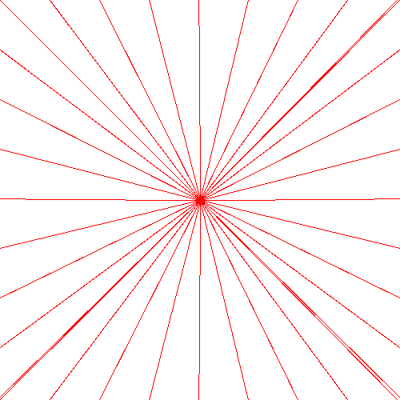
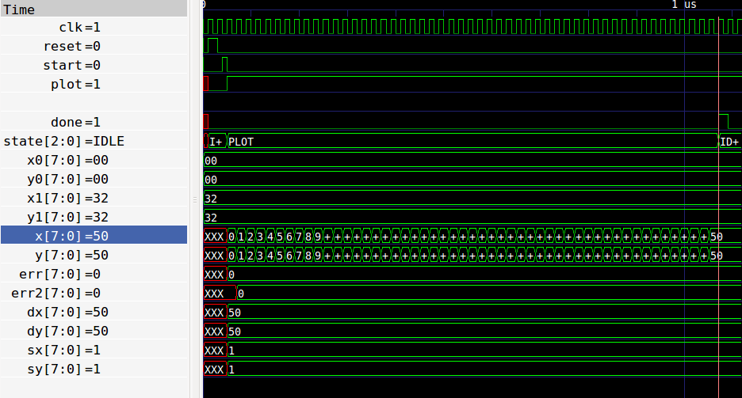

# Line drawing algorithm resources

* https://github.com/kavinr/Bresenham-Line-Drawing-Algorithm
* https://en.wikipedia.org/wiki/Bresenham%27s_line_algorithm
* https://www.youtube.com/watch?v=IDFB5CDpLDE
* http://www.cs.columbia.edu/~sedwards/classes/2015/4840/lines.pdf

Drawn using Bresenham's algorithm, adapted for integer maths: [line.py](line.py)

Shows simulation of algorithm using [bresenham.v](../bresenham.v).

After initial calculation, each pixel takes one clock cycle to draw. SRAM takes
about 10 clocks for a read then write for each pixel location.

At 640 x 480, there is a region at the bottom of the screen where the SRAM is
not being used. 45 blank lines @ 800 pix wide = 36k clocks.

So 36k / 15 clocks per pixel of a line = 2400 pixels maximum line length before
beginning to draw the screen again. Diagonal of the screen is 800px, so there is
time to draw the longest line possible.
